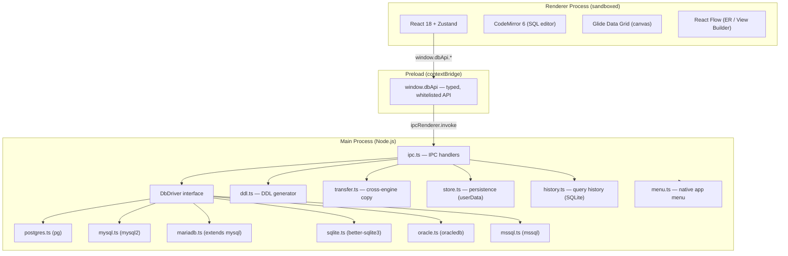
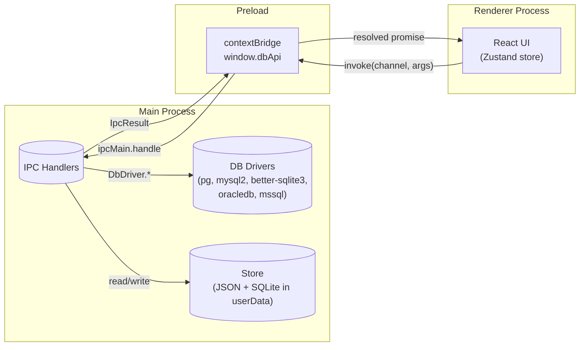
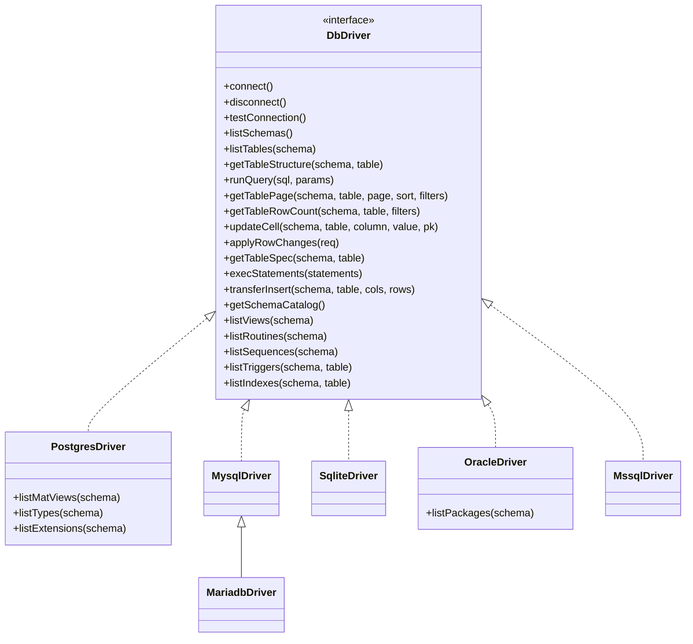
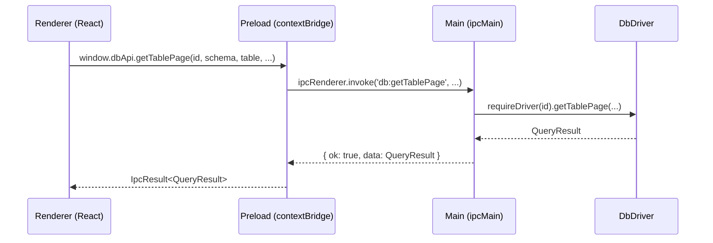
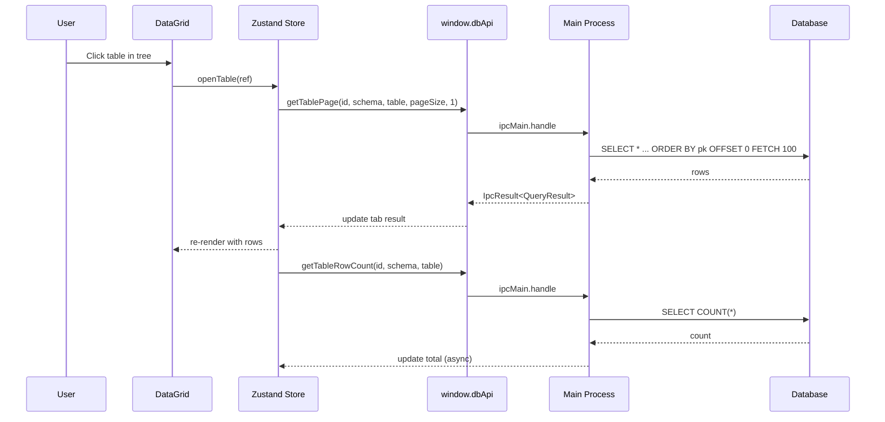
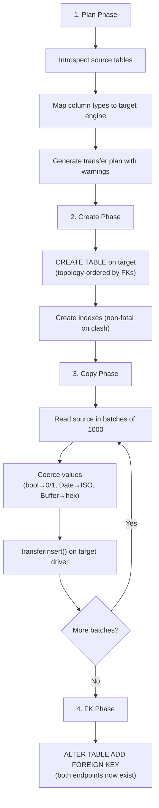
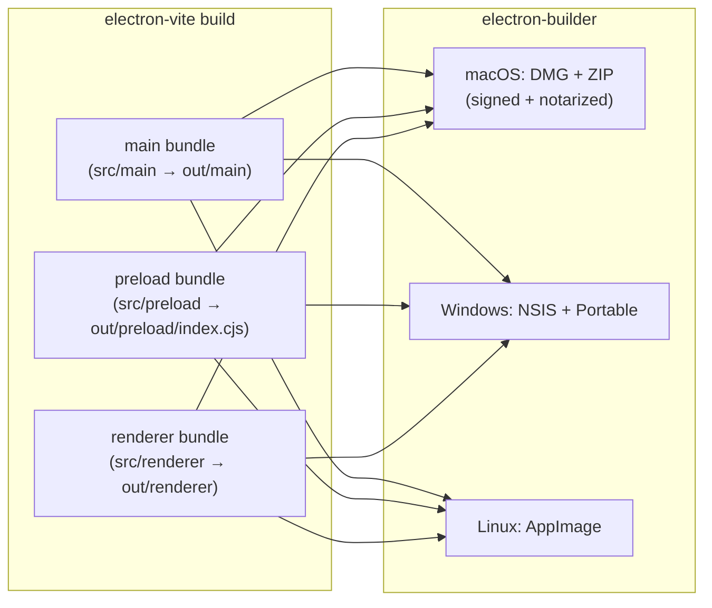

# DB Tool — Architecture

## Overview

DB Tool is a cross-platform Electron desktop application — a Navicat-style GUI for six database engines: **PostgreSQL, MySQL, MariaDB, SQLite, Oracle, and Microsoft SQL Server**. The architecture enforces a strict process boundary: all database drivers, credentials, and native modules run in the Electron **main** process; the **renderer** is a sandboxed React SPA that communicates exclusively through a typed IPC bridge.



## Process Model



### Security Posture

- `BrowserWindow`: `contextIsolation: true`, `nodeIntegration: false`, `sandbox: true`
- The renderer **never** imports `pg`, `mysql2`, `better-sqlite3`, `oracledb`, or `mssql`
- All communication goes through the whitelisted `window.dbApi` (typed `DbApi` interface)
- Passwords are encrypted at rest via Electron `safeStorage` (OS keychain) and **never** sent to the renderer
- All SQL writes use parameterized queries — never string concatenation of user values

## Directory Structure

```
db-tool/
├── build/                      # Icons, entitlements (macOS)
├── src/
│   ├── main/                   # Electron main process
│   │   ├── index.ts            # App entry: window creation, lifecycle
│   │   ├── ipc.ts              # All ipcMain.handle() registrations
│   │   ├── driver.ts           # DbDriver interface + factory
│   │   ├── drivers/
│   │   │   ├── postgres.ts     # PostgreSQL (pg)
│   │   │   ├── mysql.ts        # MySQL (mysql2)
│   │   │   ├── mariadb.ts      # MariaDB (extends MySQL)
│   │   │   ├── sqlite.ts       # SQLite (better-sqlite3)
│   │   │   ├── oracle.ts       # Oracle (oracledb thin/thick)
│   │   │   └── mssql.ts        # SQL Server (mssql/tedious)
│   │   ├── ddl.ts              # DDL generation (CREATE/ALTER TABLE)
│   │   ├── transfer.ts         # Cross-engine data transfer
│   │   ├── exporter.ts         # CSV/JSON/XLSX/SQL export
│   │   ├── importer.ts         # CSV/JSON/XLSX import
│   │   ├── dumper.ts           # Database dump/restore (.sql)
│   │   ├── history.ts          # Query history (SQLite in userData)
│   │   ├── store.ts            # Connection/UI persistence
│   │   ├── menu.ts             # Native application menu
│   │   ├── viewReverse.ts      # SQL → ViewModel parser
│   │   └── smoke.ts            # Headless smoke test
│   ├── preload/
│   │   ├── index.ts            # contextBridge (window.dbApi)
│   │   └── index.d.ts          # Type declarations
│   ├── renderer/
│   │   └── src/
│   │       ├── App.tsx          # Root component
│   │       ├── main.tsx         # React entry
│   │       ├── store.ts         # Zustand store (all UI state)
│   │       ├── styles.css       # Global styles
│   │       ├── useShortcuts.ts  # Keyboard shortcuts hook
│   │       ├── useMenuActions.ts# Native menu → store bridge
│   │       ├── sqlAutocomplete.ts # Schema-aware autocomplete
│   │       ├── treeIcons.tsx    # Tree icon components
│   │       └── components/      # 30+ React components
│   └── shared/                  # Imported by BOTH main & renderer
│       ├── types.ts             # All types, IPC channels, DbApi
│       ├── filterCompiler.ts    # WHERE clause compiler
│       ├── typeCatalog.ts       # Column type catalog per engine
│       ├── sqlSplit.ts          # SQL script splitter
│       ├── viewBuilder.ts       # Visual SELECT generator
│       ├── sequenceDdl.ts       # Sequence DDL
│       ├── triggerDdl.ts        # Trigger DDL
│       ├── indexDdl.ts          # Index DDL
│       └── rawWhere.ts          # Custom WHERE guard
├── electron.vite.config.ts      # Vite config (main/preload/renderer)
├── electron-builder.yml         # Packaging config (Win/Mac/Linux)
└── package.json
```

## Database Driver Architecture



### Driver Details

| Driver | Package | Identifier Quoting | Bind Params | Notes |
|---|---|---|---|---|
| PostgreSQL | `pg` (Pool) | `"double quotes"` | `$1, $2, ...` | Full PG-specific objects: matviews, types, extensions |
| MySQL | `mysql2/promise` (Pool) | `` `backticks` `` | `?, ?, ...` | No standalone sequences |
| MariaDB | extends MySQL | `` `backticks` `` | `?, ?, ...` | Adds standalone sequence support (10.3+) |
| SQLite | `better-sqlite3` (sync) | `"double quotes"` | `?, ?, ...` | Single file, `['main']` schema |
| Oracle | `oracledb` (thin/thick) | `"DOUBLE QUOTES"` | `:1, :2, ...` | Thin = pure JS; packages, IDENTITY sequences |
| MS SQL | `mssql/tedious` | `[brackets]` | `@p1, @p2, ...` | SQL Auth + Windows Auth; IDENTITY handling |

## IPC Flow



Every IPC call returns `IpcResult<T>`:
```typescript
type IpcResult<T> = { ok: true; data: T } | { ok: false; error: string }
```

The renderer **never** receives a rejected promise — errors are always in the `error` string field.

## Renderer Component Tree

```mermaid
graph TD
    App["App.tsx"]
    App --> CM["ConnectionManager"]
    App --> OT["ObjectTree"]
    App --> ET["EditorTabs"]
    App --> QW["QueryWorkspace"]
    App --> TD["TableDesigner"]
    App --> OE["ObjectEditor"]
    App --> VB["ViewBuilder"]
    App --> ER["ErDiagram"]
    App --> SE["SequenceEditor"]
    App --> TE["TriggerEditor"]
    App --> IE["IndexEditor"]

    QW --> SQL["SqlEditor (CodeMirror 6)"]
    QW --> DG["DataGrid (Glide)"]
    QW --> PB["PaginationBar"]
    QW --> CF["ColumnFilterPopover"]
    QW --> FB["FilterTreeEditor"]
    QW --> CW["CustomWhereBar"]
    QW --> SF["SavedFiltersPopover"]

    VB --> VTN["ViewTableNode"]
    ER --> ETN["ErTableNode"]

    App --> HP["HistoryPanel"]
    App --> TCM["TreeContextMenu"]
    App --> OOD["ObjectOpDialog"]
    App --> EXP["ExportDialog"]
    App --> IMP["ImportWizard"]
    App --> DMP["DbDumpDialog"]
    App --> RST["RestoreDialog"]
    App --> TW["TransferWizard"]
    App --> EXT["ExtensionsDialog"]
    App --> SKM["ShortcutsModal"]
```



## Data Flow: Table Browsing with Pagination



## Cross-Engine Data Transfer



## Build System



### Build Commands

| Command | Description |
|---|---|
| `npm run dev` | Development with hot-reload |
| `npm run build` | Production build to `out/` |
| `npm run package` | Windows installer + portable |
| `npm run package:mac` | macOS DMG (signed + notarized) |
| `npm run package:linux` | Linux AppImage |
| `npm run typecheck` | TypeScript check (both tsconfigs) |
| `npm run rebuild` | Rebuild better-sqlite3 for Electron ABI |

### Native Module Handling

`better-sqlite3` is a native C++ addon. During packaging:
- `npmRebuild: true` — electron-builder recompiles it for the target Electron ABI
- `asarUnpack: ["**/*.node", "node_modules/better-sqlite3/**"]` — native binaries are extracted outside the asar archive
- macOS: separately rebuilt for arm64 and x64; both architectures are signed and notarized
- Linux: cross-compiled from macOS using prebuild binaries

## Tech Stack

| Layer | Technology |
|---|---|
| Shell | Electron 33 + electron-vite |
| Language | TypeScript (strict) |
| UI Framework | React 18 |
| State | Zustand 5 |
| SQL Editor | CodeMirror 6 (`@codemirror/lang-sql`) |
| Data Grid | `@glideapps/glide-data-grid` (canvas, virtualized) |
| Diagrams | `@xyflow/react` + `@dagrejs/dagre` |
| Icons | `lucide-react` |
| PostgreSQL | `pg` |
| MySQL/MariaDB | `mysql2` |
| SQLite | `better-sqlite3` (native) |
| Oracle | `oracledb` (thin/thick) |
| MS SQL | `mssql` (tedious) |
| Import/Export | `papaparse` (CSV), `xlsx` (Excel), `node-sql-parser` |
| Packaging | `electron-builder` |
